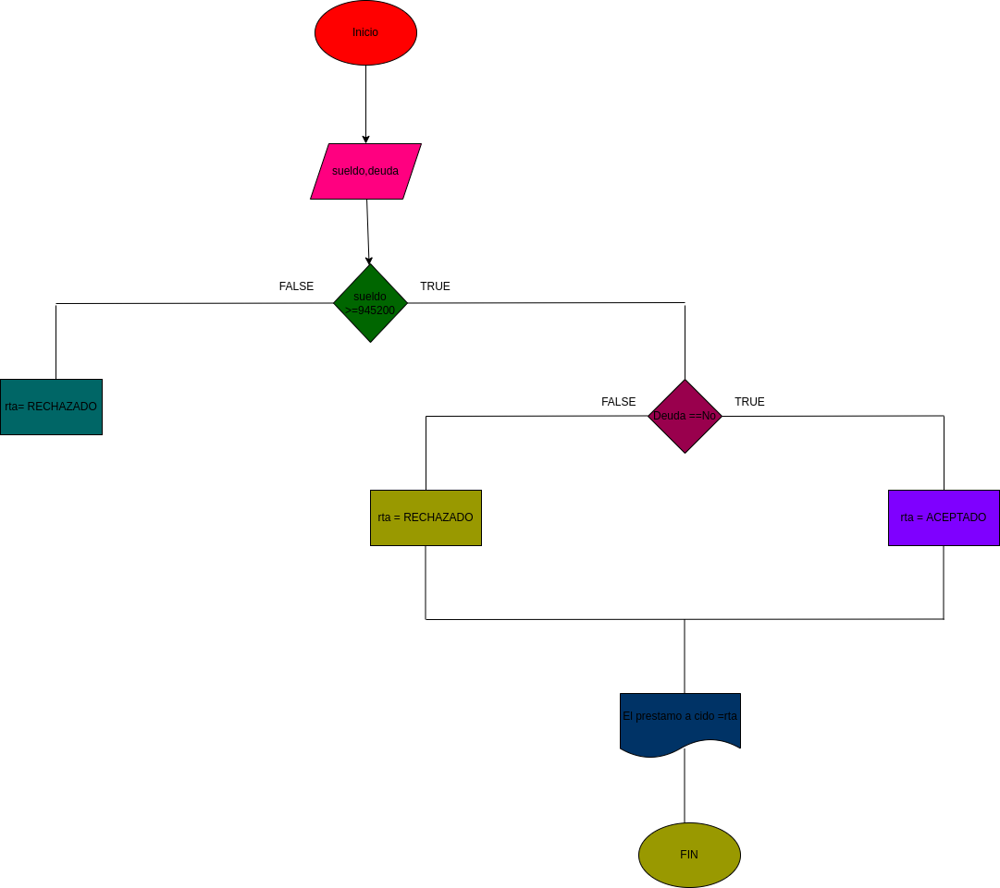

# prestamo bancario

programa para ver si usted puede adquirir un prestamo en el banco segun su salario y si tiene deudas anteriores 

# analisis

variables de entrada 

salario = el diario necesario para adquirir el prestamo 
deuda = saber si tiene deudas anteriores 

variables de proceso 

salario >= numero ingresado 
deuda = si o no tienes deudas 

variables de salida

aceptado = su prestamo fue aceptado 
denegado = su prestamo fue denegado 

nos indicara si se acepto o se denego su prestamo 

# diseño 

# construccion 